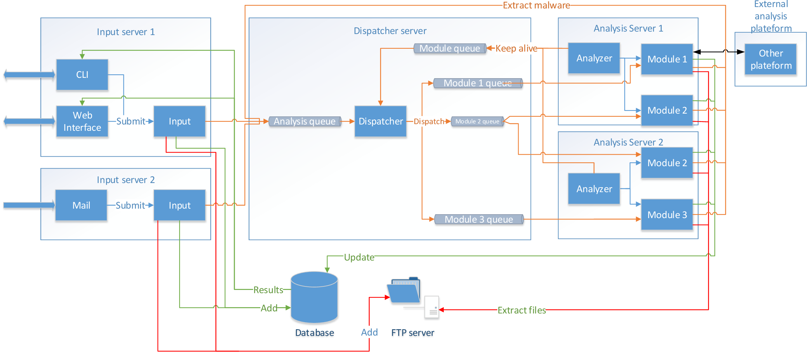
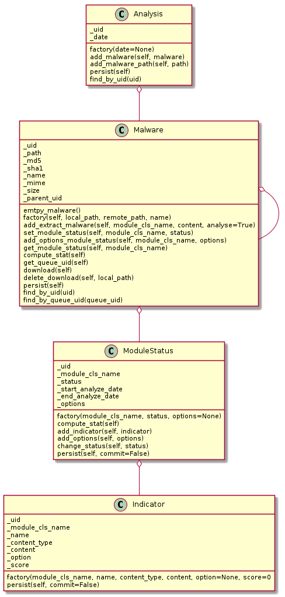

Architecture
============

Logical
-------

This schema is an example of architecture. You can use all machine as you want.
It's mandatory to all parts to have an access to DB, FTP and RMQ servers.

If you want to create an input program, you need to use the middleware Input to send your file to the dispatcher.
Then, all analysis module use a RMQ queue named with the name's module.
Each module informs the dispatcher to his presence with the module_queue queue.
The platform contains helper to use the DB, FTp and RMQ server, you need to use it.

Class diagram
-------------

This schema représente the class diagram.

An Analysis object is created when you submit files.

Each file will be a Malware object and it contains informations about this file (name, size, mime type, hashes).
A Malware object can have on or more other Malware object as child.
For example if you extract an file from the first Mlware, it will be a child of the first file.

The ModuleStatus class contains information about the analysis's module of the related malware object.
In this object you have the name of the module, start and end analysis time, the status of the analysis and options.
Options are customizable as you want.

Then for each ModuleStatus you can add Indicator.
Indicator class represent informations extracted by the analysis module.
It's defined with the ModuleStatus name, the name of the indicator, the type of content, the content, a score and options.
