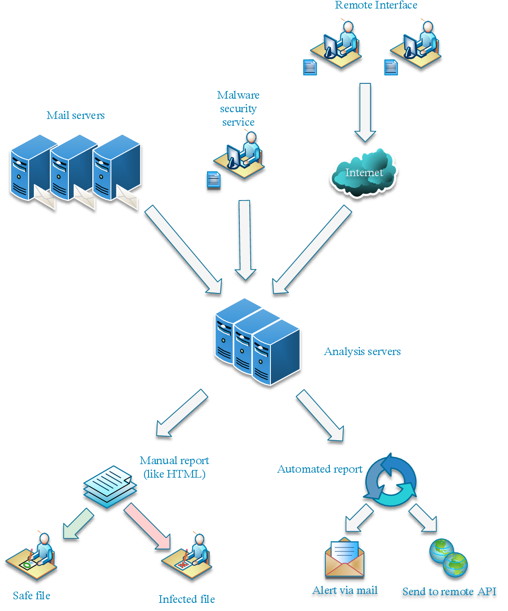
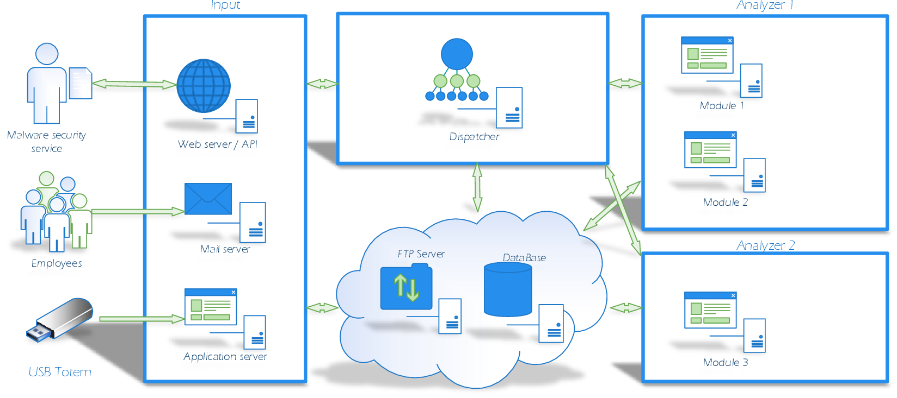

Presentation
============

LAMA is a platform for automated malware analysis.
It uses several tools and platform (like Cuckoo and IRMA)

Architecture
------------

LAMA can be run on one machine or more.
LAMA was tested on Debian 8 only, but it can work with a Debian based OS and maybe other system.

There is three parts :

- Input: part used to submit malware (CLI, Web, API, Mail, ...).
- Dispatcher: part used to dispatch malware on analysis servers.
- Analyzer: part used to analyze the malware.

In addition to LAMA you need to have :

- RabbitMQ server
- FTP server (tested with vsftp)
- Databse server (tested with PostgreSql)
